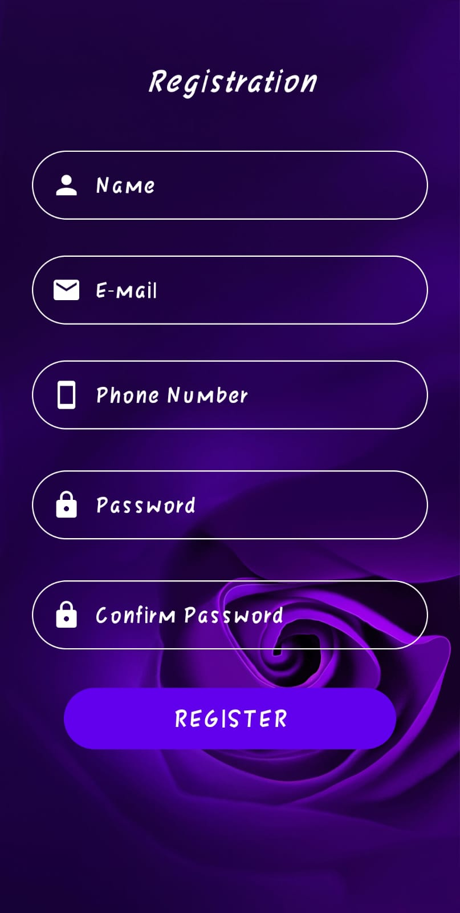
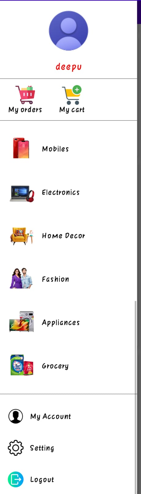
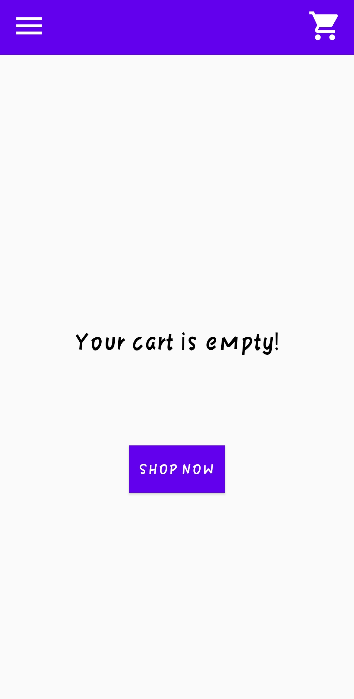
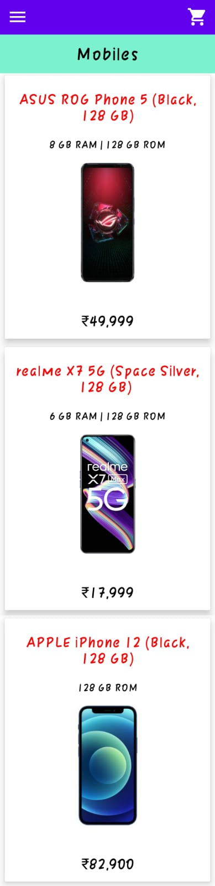
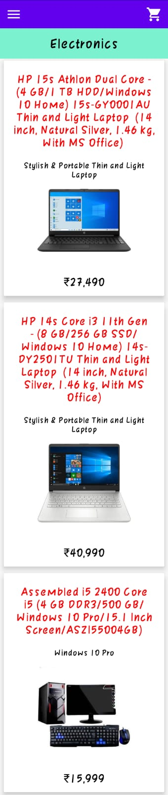
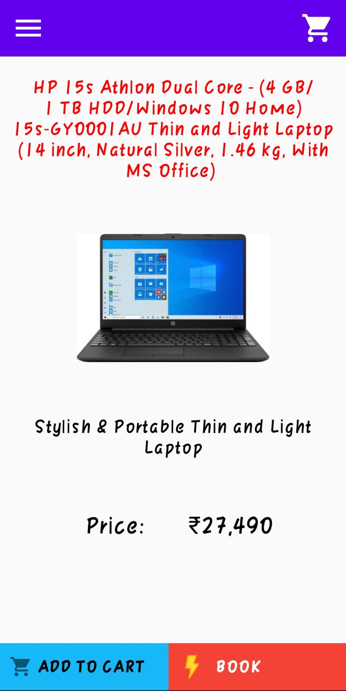
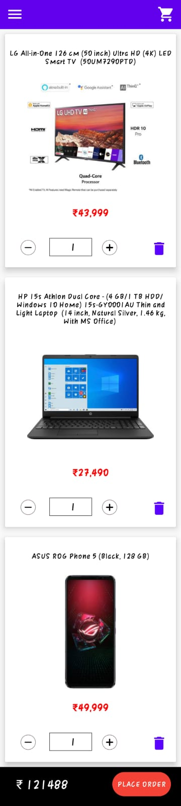
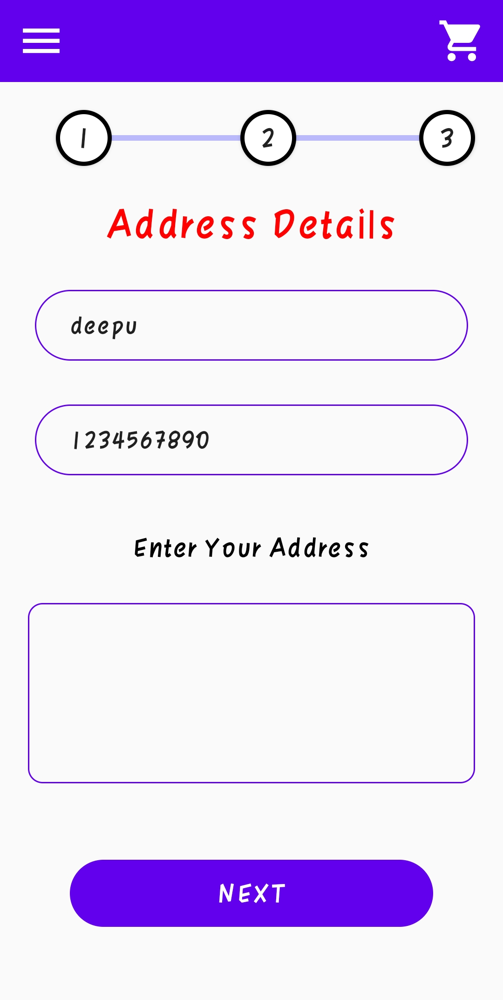
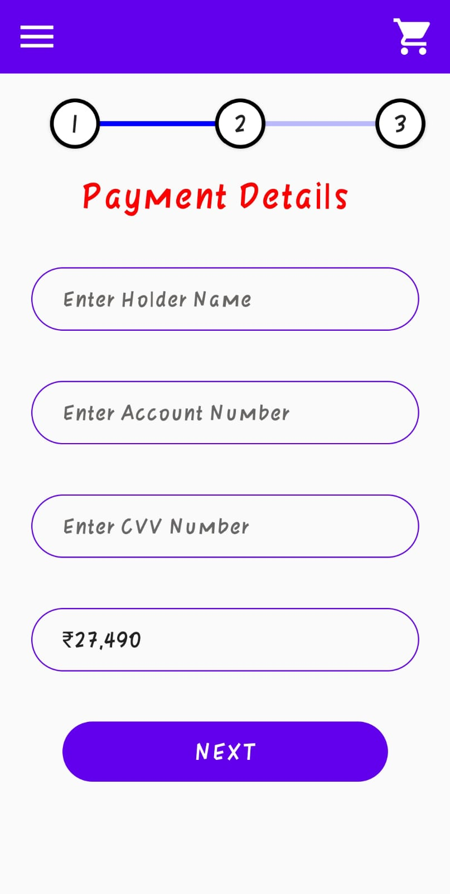
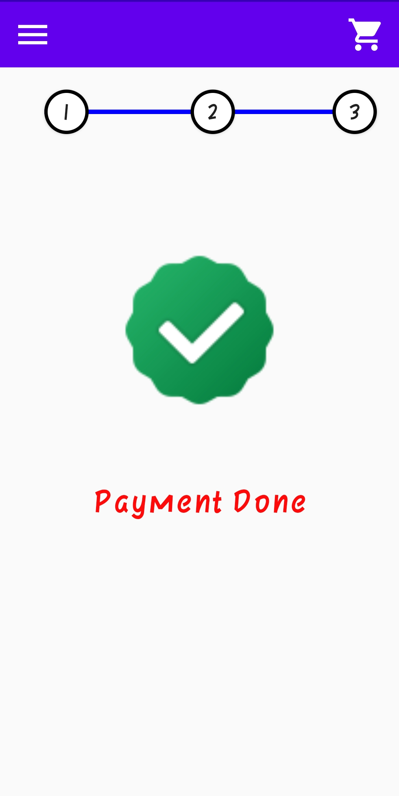

# MegaKart Android App

* This project is run only Android Platform.
* In this project using Java Language for backend and Firebase for Database.
* This app run only Android 7 version and above.
* This is the first version.So some function are not available yet.It will be available on next updates .

* IDE :- Android Studio
* OS  :- Ubuntu ( Linux )
  
  
## HOW TO DOWNLOAD THIS PROJECT

* Download the zip file.
* Extract the folder of project.
* Create a project on Firebase.
* Download the Google.Json File and paste into it location.

<h3>Login Page</h3>
</img>
<h3>Register Page</h3>
</img>
<h3>Home Page</h3>
</img>
<h3>Navdrawer</h3>
</img>
<h3>Cart Page (Empty) </h3>
</img>
<h3>Mobile Page</h3>
</img>
<h3>Electronic Page</h3>
</img>
<h3>Detail Page</h3>
</img>
<h3>Cart Page (Empty) </h3>
</img>
<h3>Address Page</h3>
</img>
<h3>Payment Page</h3>
</img>
<h3>Success Page</h3>
</img>
